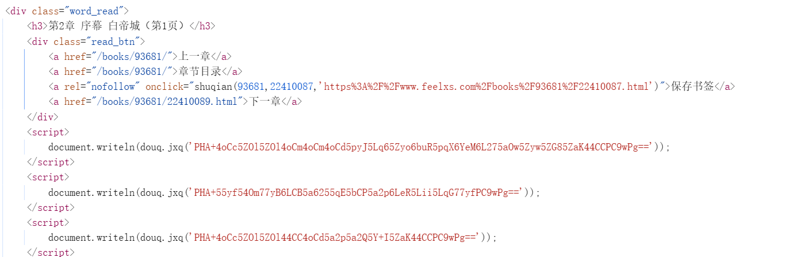
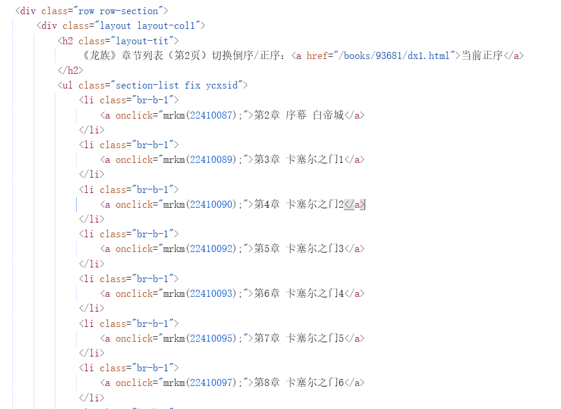
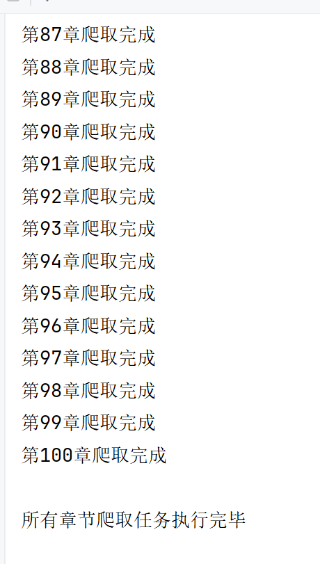

# Playwright 加密小说爬虫
基于 Python + Playwright 实现 **JS 动态加密网站小说批量爬取**
适合 Python 爬虫 / 自动化 求职作品集


## 技术栈
- Python 3
- Playwright 浏览器自动化
- XPath + 正则表达式 数据提取
- BeautifulSoup HTML 文本清洗
- 异常处理 & 工程化代码规范

## 项目背景
目标网站通过 **动态随机生成解密函数**、`document.writeln` 加密输出正文，
普通 requests 静态爬虫无法获取内容，本项目通过浏览器注入脚本逆向破解。

## 核心功能
- 1.自动抓取小说目录，批量解析所有章节链接
- 2.拦截 `document.writeln` 绕过前端 JS 加密反爬
- 3，浏览器端集合去重，解决内容重复冗余问题
- 4.自动清理 HTML 标签、过滤空行、格式化纯文本
- 5.无头浏览器静默运行，模拟真实 UA 防检测
- 6.完善异常处理：超时、解析失败、正则匹配失败、文件写入异常
- 7.单章节爬取失败不中断整体任务，容错性强

## 项目运行与原理截图展示

## 项目运行与原理截图展示

### 1. 网页源代码分析


### 2. XPath 数据提取调试


### 3. 程序运行结果

## 项目结构
Playwright-Encrypted-Novel-Crawler

├── main.py 程序入口

├── spider.py 爬虫核心逻辑

├── utils.py 文本清洗 / 工具函数

├── requirements.txt 依赖列表

├── .gitignore Git 忽略配置

├── README.md 项目说明

└── output/ 爬取结果保存目录

## 解决行业难点
1. 前端动态生成解密函数，无法硬编码逆向
2. 页面通过 writeln 分段输出，原生内容嵌套在 JS 中
3. 同内容多次写入造成文本重复
4. 网站反爬检测、阅读模式弹窗拦截

## 运行方式
1. 安装依赖
```bash
pip install -r requirements.txt
```
2.安装 Playwright 浏览器内核
```bash
playwright install chrome
```
3.运行项目
```bash
python main.py
```